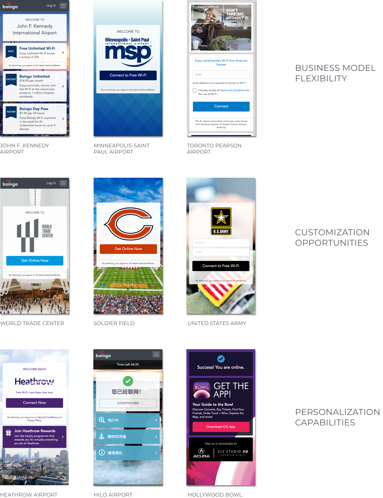
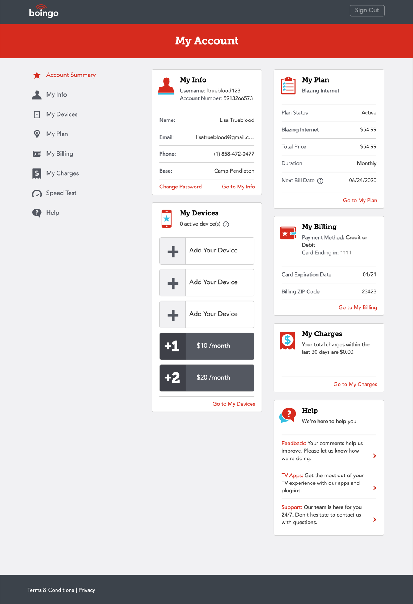

<h1>🦩 portfolio</h1>

 

<h2>MODULAR CONNECTION PORTAL</h2>
A content management system with interchangeable modules and a clean, easy-to-use design. Template capabilities include business model flexibility, customization opportunities, personalization capabilities, mobile first design, quick and easy CMS editing, localization (language support), and optimized page load times.

<h4>My Role</h4> 
I managed the product as it passed through the various stages of vision, requirements gathering, design, engineering development, initial MVP, and launch. I brought extensive knowledge of the customer, business models, CMS requirements, and Sitecore platform expertise to this project. My team was going to be the primary consumer of this product after completion, so I was intimately involved in writing requirements, testing features with engineering, as well as developing templates and building a library of assets with our creative team. My team also rolled out this new template to 100+ venues, created specification documentation, and presented the new template to existing and new clients.

<ul></ul>

<h2>MY ACCOUNT REDESIGN</h2>
This project was a redesign of the customer account management portal, where users log in to view the details of their internet plan. Customers can update their personal and billing information, view their charges and download receipts, change, reactivate, and cancel their plan, add and update their devices, take a speed test, and view self-help articles.

<h4>My Role</h4> 
I was involved in every aspect of this project. I started by leading a 2-day product development workshop with cross-functional teams including Marketing, Product, Engineering, UX, and Creative with the goal of rethinking this site from the ground up.  We thoroughly discussed our customer personas, and came up with ideas to improve their experience. This was followed by countless meetings at “the wall” where we discussed user journeys and wrote technical requirements. My responsibilities included:

<ul>
  <li>Identifying business rules and user flows</li>
  <li>User testing early designs with actual customers</li>
  <li>Working with the creative team to iterate on design</li>
  <li>Writing user stories and engineering requirements</li>
  <li>Prioritizing tickets across back-end and front-end engineering teams</li>
  <li>Customer data flow and reporting</li>
  <li>Product launch execution and go-to-market strategy</li>
  <li>Customer care training and documentation</li>
  <li>Post-launch revenue analysis and executive reporting</li>
</ul>

The results of this collaboration speak for themselves; we were able to drastically improve the user experience, reduce call volume by 37%, increase average revenue per user by 7%, and align our branding. Overall we saw annualized incremental revenue of almost $1M. I was honored to be nominated by my team and recognized for my work on this project by winning an industry award later that year. I was also asked to present the results of this project at our annual company meeting.
